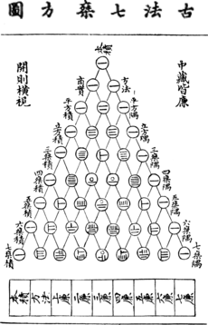

```{r setup-chunk, include=FALSE, message = FALSE, echo = FALSE, warning = FALSE}
options(
  htmltools.dir.version = FALSE,
  html.preserve.raw = FALSE # needed for windows
)

# chunk options
knitr::opts_chunk$set(echo = FALSE, message = FALSE, warning = FALSE,
                      fig.align = 'center', fig.width = 8, fig.height = 6)

# Packages
suppressMessages(library(tidyverse))
suppressMessages(library(magick))
suppressMessages(library(patchwork))
suppressMessages(library(kableExtra))


# Functions

# datasets
ie = read.csv("datasets/IE_BICT_2019.csv", sep = ";", dec = ",")
temp <- data.frame(tm = datasets::nhtemp)
```

``` {css, echo =F} 
    .h1_small h1 {
      font-weight: normal;
      margin-top: -75px;
      margin-left: -00px;
      color: #FAFAFA;
      font-size: 150%;
    }

    .pull-left-min {
      float: left;
      width: 37%;
    }

    .pull-right-min {
      float: right;
      width: 60%;
    }
    
    .fundo_capa {
      background-image: url('img/bell-curve.jpg');
      background-size: 100%;
      background-position: center;
    }
    
    .fundo_marble {
      background-image: url('img/marble.jpg');
      background-size: 140%;
      background-position: center;
    }
    
    .fundo_sistematica {
      background-image: url('img/fundo-checkered-na-perspectiva.jpg');
      background-size: 140%;
      background-position: center;
    }
    
    .regression table {
      font-size: 16px;
    }

    .regression_small table {
      font-size: 13px;
    }
    
    .font_small table {
      font-size: 0.9rem;
    }
```

```{r xaringan-scribble, echo=FALSE}
xaringanExtra::use_scribble()
```

---

class: h1_small, fundo_capa

# O modelo da distribuição normal

.pull-left[


]

.pull-right[

.content-box-gray[

___

1. Um pouco de história

1. A importância do modelo normal em estatística

1. O modelo normal de probabilidades

1. Entendendo a função normal de densidade de probabilidade

1. Cálculo de probabilidade com a função normal de densidade

1. A distribuição normal padronizada

1. Probabilidades em uma distribuição normal padronizada

___

]


]

---

class: h1_small

# 1. Um pouco de história

.pull-left[


#### Alguns atribuem a proposição deste modelo a <a href="https://en.wikipedia.org/wiki/Abraham_de_Moivre" target="_blank">Abraham de Moivre</a>, um matemático Francês que chegou a a distribuição normal como uma aproximação a <a href="https://en.wikipedia.org/wiki/Binomial_distribution" target="_blank">distribuição binomial</a> em seu livro <a href="https://en.wikipedia.org/wiki/The_Doctrine_of_Chances" target="_blank">The Doctrine of Chances</a> em $1718$.

```{r}
adm <- image_read("img/Abraham_de_moivre.jpg") %>% 
  image_resize("x320")

doc <- image_read("img/Abraham_de_moivre_Doctrine_of_Chances.jpg") %>% 
  image_resize("x320")

image_append(c(adm, doc), stack = FALSE) %>% 
  image_resize("x200")

```

<center> Abraham de Moivre (1667 - 1754)</center>

]

.pull-right[

<p><center></p>

<p><a href="https://en.wikipedia.org/wiki/Yang_Hui" target="_blank"> Triângulo de Yang Hui's de 1261</a></p></center>

]

---

class: h1_small

# 1. Um pouco de história

.pull-left[


#### A distribuição normal também é conhecida como <b>distribuição gaussiana</b>. <a href="https://en.wikipedia.org/wiki/Carl_Friedrich_Gauss" target="_blank">Carl Friedrich Gauss</a> lidou com este modelo para lidar com a distribuição dos erros de observação de um fenômeno no contexto do <a href="https://en.wikipedia.org/wiki/Least_squares" target="_blank">Método dos Mínimos Quadrados</a> em $1823$.


]

.pull-right[

</br>

```{r}
image_read("img/Gauss_10_Mark.jpg") %>% 
  image_resize("x320")

```


]

---

class: h1_small

# 1. Um pouco de história

.pull-left[


#### <a href="https://en.wikipedia.org/wiki/Pierre-Simon_Laplace target="_blank">Pierre-Simon Laplace</a> fez contribuições importantes ao modelo e aplicação da distribuição normal. Em 1782 calculou a integral \(\int e^{-t^{2}} = \sqrt{\pi}\) e, em 1810 apresentou o <a href="https://en.wikipedia.org/wiki/Central_limit_theorem target="_blank">Teorema Central do Limite</a> no contexto da agregação de várias observações independentes, contribuições fundamentais para o desenvolvimento da estatística experimental ao longo do século $XX$.

]

.pull-right[

</br>

```{r}
image_read("img/Laplace_Pierre-Simon.jpg") %>% 
  image_resize("x320")

```

<center>Pierre-Simon Laplace (1748 - 1827)</center>

]

---

class: h1_small

# 1. Um pouco de história

.pull-left[


#### Até o final do início do século \(XX\) a curva era conhecida pelo termo <b>modelo de Gauss-Lalpace</b>, quando começou a ser referida como <b>distribuição normal</b> por <a href="https://en.wikipedia.org/wiki/Karl_Pearson target="_blank">Karl Pearson</a> é vários outros autores. Pearson foi também o primeiro a escrever o modelo em termos de seu <b>desvio padrão</b> \(\sigma\). Logo em seguida, em 1915 <a href="https://en.wikipedia.org/wiki/Ronald_Fisher target="_blank">Ronald Fisher</a> adicionou o parâmetro de posição \(m\), isto é a média, expressando o modelo como fazemos atualmente.

$$df = \frac{1}{\sqrt{2 \sigma^2 \pi}}e^{-\frac{(x-m)^2}{2 \sigma}} dx$$

Finalmente, a <b>distribuição normal padrão</b>, com média \(0\) e desvio padrão \(1\) começou a apracerer nos livros texto por volta de 1950. 


]

.pull-right[

</br>

```{r}
adm <- image_read("img/Pearson_Galton.jpg") %>% 
  image_resize("x320")

doc <- image_read("img/fisher_name.jpg") %>% 
  image_resize("x320")

image_append(c(adm, doc), stack = FALSE) %>% 
  image_resize("x320")

```

<center></center>

]


---

class: h1_small

# 2. A importância do modelo normal em estatística

+ A descrição de fenômenos e predições com o modelo normal.

___


```{r, fig.align = "center", fig.height = 6, fig.width = 12}
alt_plt <- ggplot(ie, aes(x = Altura)) +
   geom_histogram(aes(y =..density..), 
                  fill = 'dodgerblue4', color = 'black', bins = 10) +
   labs(x = "Alturas em metros",
        y = "Frequencia relativa") +
  coord_cartesian(ylim = c(0, 4), xlim = c(1.4, 2.05)) +
   theme_classic(base_size = 15)

temp_plt <- ggplot(temp, aes(x = tm)) +
   geom_histogram(aes(y =..density..),
                  fill = 'dodgerblue4', color = 'black', bins = 10) +
  coord_cartesian(ylim = c(0, 0.4),  xlim = c(47, 55)) +
   labs(x = "Average Yearly Temperatures in New Haven - USA",
        y = "Frequencia relativa") +
   theme_classic(base_size = 15)

alt_plt + temp_plt

```

---

class: h1_small

# 2. A importância do modelo normal em estatística

+ A descrição de fenômenos e predições com o modelo normal.

___


```{r, fig.align = "center", fig.height = 6, fig.width = 12}
alt_plt_n <- alt_plt + 
  stat_function(fun = dnorm, args = list(mean = mean(ie$Altura, na.rm = T),
                                          sd = sd(ie$Altura, na.rm = T)),
                 color = 'red', size = 3)
  
temp_plt_n <-  temp_plt +
     stat_function(fun = dnorm, args = list(mean = mean(temp$tm, na.rm = T),
                                          sd = sd(temp$tm, na.rm = T)),
                 color = 'red', size = 3)

alt_plt_n | temp_plt_n

```

---

class: h1_small

# 2. A importância do modelo normal em estatística

+ O modelo normal com resultado do processo de amostragem
___

```{r, fig.align = "center", fig.height = 6, fig.width = 12}
image_read('img/amostragem_inferencia_3.png') %>% 
  image_scale('x450')

```

---

class: h1_small

# 3. O modelo normal de probabilidades

___

.pull-left[

</br>
$$f(x) = \frac{1}{\sqrt(2\pi\sigma^2)}e^{-\frac{1}{2}(\frac{x-\mu}{\sigma})^2}$$

]

.pull-right[

$$X \sim \mathcal{N}(\mu,\,\sigma^2)$$

Lê-se:

$X$ é uma variável aleatória com distribuição normal, média $\mu$ e desvio padrão $\sigma$.

]

___

```{r , fig.width=10, fig.height=5}
df_normp <- data.frame(X = seq(-4, 4, length = 100)) %>% 
  mutate(dx1 = dnorm(X))
         
ggplot(df_normp, aes(x = X)) +
  stat_function(fun = dnorm,
                color = 'black', size = 2) +
  annotate(geom ='text', x = 0,
           y = dnorm(0) * 1.05, 
           label = bquote(mu == ~ 'média'), 
           size = 5) +
  annotate("segment", x = 0, xend = 0, 
           y = 0.39, yend = 0, 
           colour = "black", size=2, alpha=0.4, arrow=arrow()) +
  annotate(geom ='text', x = 0,
           y = 0.12, 
           label = bquote(sigma == 'desvio padrão'), 
           size = 5, color = 'red') +
  annotate("segment", x = -1.5, xend = 1.5, 
           y = 0.1, yend = 0.1, 
           colour = "red", size=1, linetype = 2, alpha=0.4, arrow=arrow(ends = 'both')) +
  scale_x_continuous(breaks = NULL) +
  scale_y_continuous(breaks = NULL) +
  labs(y = 'f(x)', x = 'x') +
  theme_classic(base_size = 15)
```


---

class: h1_small

# 3. O modelo normal de probabilidades

___

.pull-left[

</br>
$$f(x) = \frac{1}{\sqrt(2\pi\sigma^2)}e^{-\frac{1}{2}(\frac{x-\mu}{\sigma})^2}$$

]

.pull-right[

Podemos alterar o formato da distribuição normal alterando seu parâmetos de posição (média - $\mu$) e de dispersão (desvio padrão - $\sigma$).

]

___

```{r, fig.align='center', fig.width=12, fig.height=5}
xlim = c(-10,20)
mu1 = -3; sd1 = 3
mu2 = -0; sd2 = 1
mu3 = 10; sd3 = 4
mu4 = -5; sd4 = 2
df_norm <- data.frame(X = seq(xlim[1], xlim[2], length = 100)) %>% 
  mutate(dx1 = dnorm(X, mu1, sd1),
         dx2 = dnorm(X, mu2, sd2),
         dx3 = dnorm(X, mu3, sd3),
         dx4 = dnorm(X, mu4, sd4))

ggplot(df_norm, aes(x = X)) +
  stat_function(fun = dnorm, 
                args = list(mean = mu1, sd = sd1),
                color = 'red', size = 2, alpha = 0.5) +
  stat_function(fun = dnorm, 
                args = list(mean = mu2, sd = sd2),
                color = 'blue', size = 2, alpha = 0.5) +
  stat_function(fun = dnorm, 
                args = list(mean = mu3, sd = sd3),
                color = 'green', size = 2, alpha = 0.5) +
  stat_function(fun = dnorm, 
                args = list(mean = mu4, sd = sd4),
                color = 'black', size = 2, alpha = 0.5) +
  annotate(geom ='text', x = mu1-1.5, 
           y = dnorm(mu1, mu1, sd1) * 0.5, 
           label = bquote(mu == .(mu1) ~ ';' ~ sigma == .(sd1)), 
           color = 'red', size = 5) +
  annotate(geom ='text', x = mu2, 
           y = dnorm(mu2, mu2, sd2) * 1.05, 
           label = bquote(mu == .(mu2) ~ ';' ~ sigma == .(sd2)), 
           color = 'blue', size = 5) +
  annotate(geom ='text', x = mu3, 
           y = dnorm(mu3, mu3, sd3) * 0.5, 
           label = bquote(mu == .(mu3) ~ ';' ~ sigma == .(sd3)), 
           color = 'green', size = 5) +
  annotate(geom ='text', x = mu4, 
           y = dnorm(mu4, mu4, sd4) * 1.1, 
           label = bquote(mu == .(mu4) ~ ';' ~ sigma == .(sd4)), 
           color = 'black', size = 5) +
  scale_x_continuous(breaks = seq(xlim[1], xlim[2], by = 2)) +
  coord_cartesian(xlim = xlim, ylim = c(0, 0.5)) +
  labs(y = 'f(x)', x = 'x') +
  theme_classic(base_size = 15)

```


---

class: h1_small

# 4. Entendendo a função normal de densidade de probabilidade

___

$$f(x) = \frac{1}{\sqrt(2\pi\sigma^2)}e^{-\frac{1}{2}(\frac{x-\mu}{\sigma})^2}$$

___

```{r}
mu <- round(mean(ie$Altura, na.rm = TRUE),1)
sd <- round(sd(ie$Altura, na.rm = TRUE), 2)
x <- seq(1.4, 2, by = 0.05)
dx <- dnorm(x, mean = mu, sd = sd)
posicao <- 5
```

.pull-left-min[


Encontrando $f(x)$ para pontos específicos.

___

Seja:

$\mu = `r mu`$; $\sigma = `r sd`$

O ponto $x = `r x[posicao]`$ tem:


$f(x) = \frac{1}{\sqrt(2\pi\sigma^2)}e^{-\frac{1}{2}(\frac{`r x[posicao]`-\mu}{\sigma})^2}$

$f(x) = `r round(dx[posicao], 1)`$

]

.pull-right-min[

</br>

```{r,  fig.align = "center", fig.height = 5, fig.width = 8, echo=FALSE}


df <- data.frame(x, dx)
df1 <- data.frame(x1 = x[posicao], x2 = x[posicao], y1 = 0, y2 = dx[posicao])
df2 <- data.frame(x1 = x[1], x2 = x[posicao], y1 = dx[posicao], y2 = dx[posicao])
ggplot() +
   geom_point(data = df, aes(y = dx, x = x), size = 5) +
   geom_segment(data = df1, aes(x = x1, y = y1, xend = x2, yend = y2),
                                linetype = 2, color = 'red') +
   geom_segment(data = df2, aes(x = x1, y = y1, xend = x2, yend = y2),
                                linetype = 2, color = 'red') +
   scale_y_continuous(
      name = 'f(x)',
      limits = c(0,4),
      breaks = seq(0, 4, by = 0.3)) +
   scale_x_continuous(
      name = 'X',
      limits = c(1.4,2),
      breaks = seq(1.4, 2, by = 0.05)) +
   annotate('text', x = 1.45, 
            y = dx[posicao] + .2, 
            label = bquote('f(' ~ .(x[posicao]) ~ ') = ' ~ .(round(dx[posicao],2))), 
            color = 'red') +
   theme_classic(base_size = 15)
```

]


---

class: h1_small


# 4. Entendendo a função normal de densidade de probabilidade

___

Calculo de $f(x)$ no R: a função `dnorm()`

Seja $\mu = 1.7$ e $\sigma = 0.11$
___

.pull-left[

Para $x = 1.5$ fazemos:

```{r, include = TRUE, echo = TRUE}
mu = 1.7
dp = 0.11
x = 1.5
fx = dnorm(x, mean = mu, sd = dp)
fx
```

___

$$f(x) = \frac{1}{\sqrt(2\pi`r dp`^2)}e^{-\frac{1}{2}(\frac{`r x`-`r mu`}{`r dp`})^2} = `r round(fx,2)`$$

___

]

.pull-right[

E para múltiplos valores de $x$:

```{r echo = TRUE}
mu = 1.7
dp = 0.11
x = c(1.4, 1.5, 1.6, 1.7)
fx = dnorm(x, mean = mu, sd = dp)
fx
```

]

---


class: h1_small

# 5. Cálculo de probabilidade com a função normal de densidade

___

A distribuição normal é uma função de densidade de **probabilidade**.

___

.pull-left-min[

$$f(x) = \frac{1}{\sqrt(2\pi\sigma^2)}e^{-\frac{1}{2}(\frac{x-\mu}{\sigma})^2}$$

___

</br>

.content-box-green[

A **área** abaixo de $f(x)$ entre $-\infty$ e $+\infty$ é igual a $1$.

$$P(-\infty \le X \le +\infty) = \int_{-\infty}^{+\infty}f(x) dx = 1$$
]

]

.pull-right-min[

</br>

```{r,  fig.align = "center", fig.height = 5, fig.width = 8, echo=FALSE}
sup <- 20
dfc <- data.frame(X = seq(0,sup, length = 1000)) %>% 
  mutate(dx = dnorm(X, mean = sup/2, sd = 2.05))
gc1 <- ggplot(dfc, mapping = aes(y = dx, x = X)) +
   stat_function(fun = dnorm, args = list(mean = sup/2, sd = 2.05)) +
  geom_area(mapping = aes(x = X), fill = '#eb4034', alpha = 0.3) + 
   scale_x_continuous(
       name = 'X',
       limits = c(1,20),
       breaks = NULL) +
   ylab('f(x)') +
   annotate(geom = 'text', x = sup/2, y = 0.08, label = bquote("Área = 1"),
            color = 'black', size = 9) +
   theme_classic(base_size = 15)
gc1   
```


]

---

class: h1_small

# 5. Cálculo de probabilidade com a função normal de densidade

___

A distribuição normal é uma função de densidade de **probabilidade**.

___

.pull-left-min[

</br>

.content-box-green[

Utilizamos a distribuição normal para encontrar a probabilidade de uma variável aleatória $X$ estar entre $x_1$ e $x_2$, o que corresponde a encontrar a **área** abaixo de $f(x)$.

$$P(x_1 \le X \le x_2) = \int_{x_1}^{x_2}f(x) dx$$
]


]

.pull-right-min[

</br>

```{r,  fig.align = "center", fig.height = 5, fig.width = 8, echo=FALSE}
gc2 <- ggplot(dfc, mapping = aes(y = dx, x = X)) +
   stat_function(fun = dnorm, args = list(mean = sup/2, sd = 2.05)) +
   geom_area(mapping = aes(x = ifelse(test = X >=7 & X <=9, yes = X, no = 0)), fill = '#eb4034') +
   geom_area(mapping = aes(x = ifelse(test = X < 7.1, yes = X, no = 0)), fill = NA) +
   geom_area(mapping = aes(x = ifelse(test = X >8.9, yes = X, no = 0)), fill = NA) +
   scale_x_continuous(
      name = 'X',
      limits = c(1,20),
      breaks = c(7, 9),
      label = c('x1', 'x2')) +
   ylab('f(x)') +
   annotate(geom = 'text', x = 4.7, y = 0.15, label = bquote("Área = P(" ~ 'x'[1] <= ~ "X" <= ~ 'x'[2] ~")"),
            color = '#eb4034', size = 6) +
   theme_classic(base_size = 15)
gc2  
```

]

---

class: h1_small


# 5. Cálculo de probabilidade com a função normal de densidade

___

Cálculo de $P(X)$ no R: a função `pnorm()`

Seja $\mu = 1.7$ e $\sigma = 0.11$
___

.pull-left[

$P(X \le 1.5$):

```{r, include = TRUE, echo = TRUE}
mu = 1.7
dp = 0.11
pnorm(q = 1.5, mean = mu, sd = dp, lower.tail = TRUE)
```

___

$P(X \ge 1.5)$ --> `lower.tail == FALSE`: 

```{r, include = TRUE, echo = TRUE}
mu = 1.7
dp = 0.11
pnorm(q = 1.5, mean = mu, sd = dp, lower.tail = FALSE)
```

]

.pull-right[


```{r, warning=FALSE, fig.align='center', fig.width=6, fig.height=6}
p1 <- pnorm(q = 1.5, mean = mu, sd = dp, lower.tail = TRUE)
p2 <- pnorm(q = 1.5, mean = mu, sd = dp, lower.tail = FALSE)

sup <- 20
dfc <- data.frame(X = seq(0,sup, length = 10000)) %>% 
  mutate(dx = dnorm(X, mean = mu, sd = dp))


gc1 <- ggplot(dfc, mapping = aes(y = dx, x = X)) +
   stat_function(fun = dnorm, args = list(mean = mu, sd = dp)) +
   geom_area(mapping = aes(x = ifelse(test = X <= 1.5, yes = X, no = 0)), fill = '#eb4034') +
   geom_area(mapping = aes(x = ifelse(test = X > 1.5, yes = X, no = 0)), fill = NA) +
   scale_x_continuous(
      name = 'X',
      limits = c(1.4,2),
      breaks = seq(1.4, 2, by = 0.05)) +
   ylab('f(x)') +
   annotate(geom = 'text', x = 1.5, y = 3, label = bquote("P(X" <= ~ 1.5 ~")" == .(round(p1,3))),
            color = '#eb4034') +
   theme_classic()

gc2 <- ggplot(dfc, mapping = aes(y = dx, x = X)) +
   stat_function(fun = dnorm, args = list(mean = mu, sd = dp)) +
   geom_area(mapping = aes(x = ifelse(test = X > 1.5, yes = X, no = 0)), fill = '#eb4034') +
   geom_area(mapping = aes(x = ifelse(test = X <= 1.5, yes = X, no = 0)), fill = NA) +
   scale_x_continuous(
      name = 'X',
      limits = c(1.4,2),
      breaks = seq(1.4, 2, by = 0.05)) +
   ylab('f(x)') +
   annotate(geom = 'text', x = 1.5, y = 3, label = bquote("P(X" >= ~ 1.5 ~")" == .(round(p2,3))),
            color = '#eb4034') +
   theme_classic()

gc1 / gc2
```


]


---

class: h1_small


# 5. Cálculo de probabilidade com a função normal de densidade

___

Cálculo de $P(X)$ no R: a função `pnorm()`

Seja $\mu = 1.7$ e $\sigma = 0.11$
___

.pull-left[

$$P(1.5 \le X \le 1.7) = P(X \le 1.7) - P(X \le 1.5)$$

```{r echo = FALSE}
pfinal <- diff(pnorm(q = c(1.5, 1.7),
           mean = mu,
           sd = dp,
           lower.tail = TRUE)
     )
```


```{r echo = TRUE}
P1 = pnorm(q = 1.5, mean = mu, sd = dp)
P2 = pnorm(q = 1.7, mean = mu, sd = dp)
Pintervalo = P2 - P1
Pintervalo
```

]

.pull-right[


```{r, warning=FALSE, fig.align='center', fig.width=6, fig.height=6}
dfc <- data.frame(X = seq(0,sup, length = 10000)) %>% 
  mutate(dx = dnorm(X, mean = mu, sd = dp))

gc3 <- ggplot(dfc, mapping = aes(y = dx, x = X)) +
   stat_function(fun = dnorm, args = list(mean = mu, sd = dp)) +
   geom_area(mapping = aes(x = ifelse(test = X >=1.5 & X <=1.7, yes = X, no = 0)), fill = '#eb4034') +
   geom_area(mapping = aes(x = ifelse(test = X < 1.5, yes = X, no = 0)), fill = NA) +
   geom_area(mapping = aes(x = ifelse(test = X > 1.7, yes = X, no = 0)), fill = NA) +
   scale_x_continuous(
      name = 'X',
      limits = c(1.4,2),
      breaks = seq(1.4, 2, by = 0.05)) +
   ylab('f(x)') +
   annotate(geom = 'text', x = 1.5, y = 3, label = bquote("P(" ~ 1.5 <= ~ "X" <= ~ 1.7 ~")" == .(round(pfinal,3))),
            color = '#eb4034') +
   theme_classic()
  
gc3
```


]


---

class: h1_small


# 6. A distribuição normal padronizada


___

Historicamente, o cálculo da área na distribuição normal foi conduzido com o uso da distribuição normal **padronizada**.

___

.pull-left[


$$f(x) = \frac{1}{\sqrt(2\pi)}e^{-\frac{1}{2}x^2}$$

]

.pull-right[

$$X \sim \mathcal{N}(0,\,1)$$

$X$ é uma variável aleatória com distribuição normal **padronizada** se, média $\mu = 0$ e desvio padrão $\sigma = 1$.

]

___

```{r , fig.width=10, fig.height=4.5}
df_normp <- data.frame(X = seq(-4, 4, length = 100)) %>% 
  mutate(dx1 = dnorm(X))
         
norm_st = ggplot(df_normp, aes(x = X)) +
  stat_function(fun = dnorm,
                color = 'black', size = 2) +
  annotate(geom ='text', x = 0,
           y = dnorm(0) * 1.05, 
           label = bquote(mu == ~ 'média = 0'), 
           size = 5) +
  annotate("segment", x = 0, xend = 0, 
           y = 0.39, yend = 0, 
           colour = "black", size=2, alpha=0.4, arrow=arrow()) +
  annotate(geom ='text', x = 0,
           y = 0.12, 
           label = bquote(sigma == 'desvio padrão = 1'), 
           size = 5, color = 'red') +
  annotate("segment", x = -1.5, xend = 1.5, 
           y = 0.1, yend = 0.1, 
           colour = "red", size=1, linetype = 2, alpha=0.4, arrow=arrow(ends = 'both')) +
  scale_x_continuous(breaks = NULL) +
  scale_y_continuous(breaks = NULL) +
  labs(y = 'f(x)', x = 'x') +
  theme_classic(base_size = 25)

norm_st
```

---

class: h1_small


# 6. A distribuição normal padronizada: a tabela Z


.pull-left[

</br></br></br></br>

```{r , fig.width=10, fig.height=4.5}
norm_st + xlab('z') + ylab('f(z)')
```

]

.pull-right[

```{r}
image_read("img/Tabelz_Z_imagem.png") %>% 
  image_resize("x450")

```

]

---

class: h1_small


# 6. A distribuição normal padronizada: a transformação Z


___


$$z_i = \frac{x_i - \mu}{\sigma}$$

___

.pull-left[

```{r , fig.width=7, fig.height=6}
mu = 50
sigma = 5
df_normp <- data.frame(X = seq(mu -4*sigma, mu + 4*sigma, length = 100)) %>% 
  mutate(dx1 = dnorm(X, mean = mu, sd = sigma))
         
norm_nst = ggplot(df_normp, aes(x = X)) +
  stat_function(fun = dnorm, args = list(mean = mu, sd = sigma),
                color = 'black', size = 2) +
  annotate(geom ='text', x = mu,
           y = dnorm(mu, mean = mu, sd = sigma) * 1.05, 
           label = bquote(mu == ~ 'média =' ~ .(mu)), 
           size = 5) +
  annotate("segment", x = mu, xend = mu, 
           y = 0.07, yend = 0, 
           colour = "black", size=2, alpha=0.4, arrow=arrow()) +
  annotate(geom ='text', x = mu,
           y = 0.02, 
           label = bquote(sigma == 'desvio padrão =' ~ .(sigma)), 
           size = 5, color = 'red') +
  annotate("segment", x = 40, xend = 60, 
           y = 0.01, yend = 0.01, 
           colour = "red", size=1, linetype = 2, alpha=0.4, arrow=arrow(ends = 'both')) +
  scale_x_continuous(breaks = seq(-4*sigma, 4*sigma, l = 10)) +
  labs(y = 'f(x)', x = 'x') +
  theme_classic(base_size = 25)

norm_nst
```

]

.pull-right[

```{r , fig.width=7, fig.height=6}
norm_st + xlab('z') + ylab('f(z)')
```

]

---

class: h1_small


# 6. A distribuição normal padronizada: a transformação Z


___


$$z_i = \frac{x_i - \mu}{\sigma}$$

___

.pull-left[


```{r}
mu = 1.7
sd = 0.11
x = 1.5
z = (x - mu)/sd
```


Seja $\mu = `r mu`$ e $\sigma = `r sd`$

A observação $x = `r x`$ corresponte a:

$$z_i = \frac{x_i - \mu}{\sigma} = \frac{`r x` - `r mu`}{`r sd`} = `r round(z,2)`$$

.content-box-green[

Em uma distribuição normal com $\mu = `r mu`$ e $\sigma = `r sd`$, a observação $x = `r x`$ está $`r round(abs(z),2)`$ desvios padrões `r ifelse(z < 0, yes = 'abaixo', no = 'acima')` da média.

]

]

.pull-right[

```{r}
mu = 1.7
sd = 0.11
x = 1.9
z = (x - mu)/sd
```


Seja $\mu = `r mu`$ e $\sigma = `r sd`$

A observação $x = `r x`$ corresponte a:

$$z_i = \frac{x_i - \mu}{\sigma} = \frac{`r x` - `r mu`}{`r sd`} = `r round(z,2)`$$

.content-box-green[

Em uma distribuição normal com $\mu = `r mu`$ e $\sigma = `r sd`$, a observação $x = `r x`$ está $`r round(abs(z),2)`$ desvios padrões `r ifelse(z < 0, yes = 'abaixo', no = 'acima')` da média.

]


]

---

class: h1_small


# 6. A distribuição normal padronizada

Após a transformação $Z$ nos exemplos sobre altura dos alunos e chuva mensal temos: 

```{r, fig.align = "center", fig.height = 7, fig.width = 13, echo=FALSE}
ie <- ie %>% 
   mutate(Altura_z = (Altura - mean(Altura, na.rm = T))/sd(Altura, na.rm = T))
temp <- temp %>% 
   mutate(tm_z = (tm - mean(tm, na.rm = T))/sd(tm, na.rm = T))

altz_plt <- ggplot(ie, aes(x = Altura_z)) +
   geom_histogram(aes(y =..density..), 
                  fill = 'dodgerblue4', color = 'black', bins = 12) +
   stat_function(fun = dnorm, args = list(mean = mean(ie$Altura_z, na.rm = T),
                                          sd = sd(ie$Altura_z, na.rm = T)), 
                 size = 3) +
   labs(x = "Distribuição Z",
        y = "Frequencia relativa") +
   theme_classic(base_size = 15)

tempz_plt <- ggplot(temp, aes(x = tm_z)) +
   geom_histogram(aes(y =..density..),
                  fill = 'dodgerblue4', color = 'black', bins = 10) +
   stat_function(fun = dnorm, args = list(mean = mean(temp$tm_z, na.rm = T),
                                          sd = sd(temp$tm_z, na.rm = T)),
                 size = 3) +
   labs(x = "Distribuição Z",
        y = "Frequencia relativa") +
   theme_classic(base_size = 15)

(alt_plt_n | temp_plt_n) / 
  (altz_plt | tempz_plt)

```

---

class: h1_small

# 6. Probabilidades em uma distribuição normal padronizada

___

Limites conhecidos de probabilidade

___

``` {r fig.width=12, fig.height=6.5, fig.align = "center", echo=FALSE}
qr = qnorm(p = c(1-c(0.995, 0.975, 0.95),0.5,c(0.95, 0.975, 0.995)))
dqr = dnorm(x = qr)


qrc1 = c(qr[3], qr[5], seq(qr[5],qr[3], by = -0.001))
dqrc1 = c(0, 0, dnorm(x = seq(qr[5],qr[3], by = -0.001)))

qrc2 = c(qr[6], qr[7], seq(qr[7], qr[6], by = -0.001))
dqrc2 = c(0, 0, dnorm(x = seq(qr[7], qr[6], by = -0.001)))

qrc2m = c(qr[1], qr[2], seq(qr[2],qr[1], by = -0.001))
dqrc2m = c(0, 0, dnorm(x = seq(qr[2],qr[1], by = -0.001)))

pqr = pnorm(q = qr)
perc = diff(pqr) * 100

curve(expr = dnorm(x, 0,1), from = -4, to = 4, 
      ylab = "Densidade da distribuição normal padronizada",
      xlab = "Distribuição de Z", ylim = c(0, 0.7), axes = F)
axis(1, at = -5:5, cex.axis = 0.8)
axis(2, at = seq(-1, 0.5, by = 0.1), cex.axis = 0.8)
segments(x0 = qr, x1 = qr, y0 = 0, y1 = c(0.65, 0.55, 0.45, dnorm(0), 0.45, 0.55, 0.65), lty = 2)
polygon(x = qrc1, y = dqrc1, col = rgb(red = 0.9, 0,0, alpha = 0.5))  
polygon(x = qrc2, y = dqrc2, col = rgb(red = 0.9, 0,0, alpha = 0.5))  
polygon(x = qrc2m, y = dqrc2m, col = rgb(red = 0.9, 0,0, alpha = 0.5))
segments(x0 = qr[1], x1 = qr[7], y0 = 0.65, y1 = 0.65, lwd = 2)
segments(x0 = qr[2], x1 = qr[6], y0 = 0.55, y1 = 0.55, lwd = 2)
segments(x0 = qr[3], x1 = qr[5], y0 = 0.45, y1 = 0.45, lwd = 2)
text(x = 0, y = 0.67, labels = bquote(.(round(diff(pnorm(q = c(qr[1],qr[7]))*100),0)) ~ "% entre " ~ .(round(qr[1],2)) ~ " e " ~ .(round(qr[7],2))), cex = 1.2)
text(x = 0, y = 0.57, labels = bquote(.(round(diff(pnorm(q = c(qr[2],qr[6]))*100),0)) ~ "% entre " ~ .(round(qr[2],2)) ~ " e " ~ .(round(qr[6],2))), cex = 1.2)
text(x = 0, y = 0.47, labels = bquote(.(round(diff(pnorm(q = c(qr[3],qr[5]))*100),0)) ~ "% entre " ~ .(round(qr[3],2)) ~ " e " ~ .(round(qr[5],2))), cex = 1.2)    
```


---

class: h1_small

# 6. Probabilidades em uma distribuição normal padronizada

___

Limites conhecidos de probabilidade

___

```{r, fig.align = "center", fig.height = 6, fig.width = 12}
image_read('img/amostragem_inferencia_3.png') %>% 
  image_scale('x425')

```
