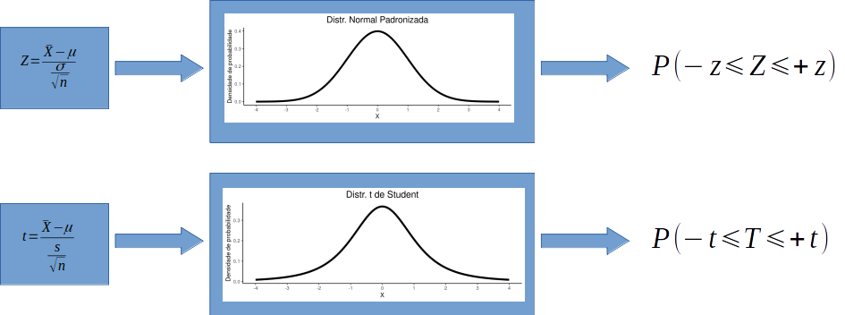

```{r setup-chunk, include=FALSE, message = FALSE, echo = FALSE, warning = FALSE}
options(
  htmltools.dir.version = FALSE,
  html.preserve.raw = FALSE # needed for windows
)

# chunk options
knitr::opts_chunk$set(echo = FALSE, message = FALSE, warning = FALSE)

# Packages
suppressMessages(library(tidyverse))
suppressMessages(library(kableExtra))
suppressMessages(library(DT))
suppressMessages(library(gridExtra))

# Functions
source('r_functions/auxiliary_fun.r', encoding = "UTF-8")

```

``` {css, echo =F} 
    .h1_small h1 {
      font-weight: normal;
      margin-top: -75px;
      margin-left: -00px;
      color: #FAFAFA;
      font-size: 150%;
}

    .pull-left-min {
      float: left;
      width: 70%;
    }

    .pull-right-min {
      float: right;
      width: 27%;
    }
    
    .golden-jackals {
      background-image: url('img/Golden_jackals.jpg');
      background-size: 30%;
      background-position: left bottom;
    }

```

```{r xaringan-scribble, echo=FALSE}
xaringanExtra::use_scribble()
```
---

class: h1_small

# Conteúdo da aula

___

1. Distribuição $t$ de *Student*

1. Estatística $t$ *versus* Estatística $z$: aumento dos graus de liberdade

1. Teste $t$ para uma média amostral

1. Teste $t$ para duas médias independentes
  
  - Teste $t$ de Welch - variâncias heterogêneas
  
  - Comparando variâncias
  
  - Teste $t$ variâncias homogêneas

1. Teste $t$ pareado para duas médias dependentes

___

---

class: center, h1_small

# Distribuição *t* de Student: Biometrika. 1908, vol. 6, 1-15

.pull-left-min[

```{r, out.width="90%", fig.align = 'center'}
knitr::include_graphics("img/Student_1908_first_paragf.png")
```

]

.pull-right-min[

```{r, out.width="70%", fig.align = 'rigth', fig.cap = 'William Sealy Gosset (1876 - 1937)'}
knitr::include_graphics("img/William_Sealy_Gosset.jpg")
```

]

---

class: center, h1_small

# Distribuição *t* de Student: Biometrika. 1908, vol. 6, 1-15

> O Teorema Central do Limite garante que a distribuição de $\overline{X}$ tende à normalidade à medida que $n$ aumenta.

> No entanto, para amostras pequenas a distribuição t de Student fornece uma aproximação melhor para a distribuição das médias amostrais.

```{r, out.width="90%", fig.align = 'center'}

```

---

class: center, h1_small

# Distribuição *t* de Student: Biometrika. 1908, vol. 6, 1-15

```{r, out.width="90%", fig.align = 'center'}

```

---

class: center, h1_small

# Distribuição *t* de Student: Biometrika. 1908, vol. 6, 1-15


.pull-left[

*Distribuição t*

```{r, fig.height=6, fig.width=7.0}
plt_dt_fun(gl = 4, fill_area = 'outer',
           alpha_sl = 0.05, alternative = 'two-sided',
           label_limits = 'numeric',
           from_alpha = TRUE)$plt
```


]

.pull-right[

*Distribuição Normal Padronizada*

```{r, fig.height=6, fig.width=7.0}
plt_norm_fun(alpha_sl = 0.05,
             distribution = 'Z',
             fill_area = 'outer',
             alternative = 'two-sided',
             label_limits = 'numeric',
             from_alpha = TRUE)$plt
```

]

---

class: center, h1_small

# Distribuição *t* de Student: Biometrika. 1908, vol. 6, 1-15


.pull-left[

*Distribuição t*

```{r, fig.height=6, fig.width=7.0}
plt_dt_fun(gl = 30, fill_area = 'outer',
           alpha_sl = 0.05, alternative = 'two-sided',
           label_limits = 'numeric',
           from_alpha = TRUE)$plt
```


]

.pull-right[

*Distribuição Normal Padronizada*

```{r, fig.height=6, fig.width=7.0}
plt_norm_fun(alpha_sl = 0.05,
             distribution = 'Z',
             fill_area = 'outer',
             alternative = 'two-sided',
             label_limits = 'numeric',
             from_alpha = TRUE)$plt

```

]

---

class: center, h1_small

# Distribuição *t* de Student: Biometrika. 1908, vol. 6, 1-15


.pull-left[

*Distribuição t*

```{r, fig.height=6, fig.width=7.0}
plt_dt_fun(gl = 100, fill_area = 'outer',
           alpha_sl = 0.05, alternative = 'two-sided',
           label_limits = 'numeric',
           from_alpha = TRUE)$plt
```


]

.pull-right[

*Distribuição Normal Padronizada*

```{r, fig.height=6, fig.width=7.0}
plt_norm_fun(alpha_sl = 0.05,
             distribution = 'Z',
             fill_area = 'outer',
             alternative = 'two-sided',
             label_limits = 'numeric',
             from_alpha = TRUE)$plt

```

]

---

class: h1_small

# Teste $t$ para uma média amostral

#### A diversidade média de peixes em riachos costeiros de Mata Atlântica tem distribuição normal com $\mu = 2.65$. Você dispõe de amostras para 10 riachos que obtidas na década de 70. Com estas amostras, deseja testar se houve mudança na diversidade média ao longo dos últimos 50 anos.

___

```{r}
set.seed(839)
n <- 10
mu <- 2.65
amostra  <- round(rnorm(n = n, mean = mu, sd = 0.5),2)
dp <- sd(amostra)
ep <- dp/sqrt(n)
tc <- (mean(amostra) - mu)/ep
teste_t <- t.test(amostra, mu = mu, alternative = 'two.sided')

fig_teste <- plt_dt_fun(gl = n-1, tc = tc,
           alternative = 'two-sided',
           fill_area = 'outer',
           label_limits = 'numeric',
           from_alpha = FALSE)
p_valor <- fig_teste$area_lower + fig_teste$area_lower

```

.pull-left[

#### Hipóteses estatísticas

$H_0: \mu = 2.65$ (Hipótese nula)

$H_a: \mu \ne 2.65$ (Hipótese alternativa)

$\alpha = 0.05$ (nível de significância)

```{r}
kableExtra::kbl(matrix(amostra, nrow = 2), col.names = NA, caption  = 'Diversidade nos riachos')
```

]

.pull-right[

A média amostral nos `r n` riachos: 

$\overline{X} = \frac{\sum{X_i}}{n} = `r round(mean(amostra),2)`$

com erro padrão de:

$s_{\overline{X}} = \frac{s}{\sqrt{n}} = \frac{`r round(dp,2)`}{`r round(sqrt(n),2)`} = `r round(ep,2)`$

e um valor de $t_{calculado}$:

$t_c = \frac{\overline{X} - \mu}{s_{\overline{X}}} = \frac{`r round(mean(amostra),2)` - `r mu`}{`r round(ep,2)`} = `r round(tc,2)`$


]

---

class: h1_small

# Teste $t$ para uma média amostral

#### A diversidade média de peixes em riachos costeiros de Mata Atlântica tem distribuição normal com $\mu = 2.65$. Você dispõe de amostras para 10 riachos que obtidas na década de 70. Com estas amostras, deseja testar se houve mudança na diversidade média ao longo dos últimos 50 anos.

___

.pull-left[

#### Hipóteses estatísticas

$H_0: \mu = 2.65$ (Hipótese nula)

$H_a: \mu \ne 2.65$ (Hipótese alternativa)

$\alpha = 0.05$ (nível de significância)

Utilizando a Tabela t, encontramos a probabilidade de obtermos valores tão ou mais extremos que $-`r round(tc,2)`$ e $+`r round(tc,2)`$.

]

.pull-right[


#### Segundo $H_0$

```{r, fig.height=5, fig.width=6.0}
fig_teste$plt
```

]

---

class: h1_small


# Teste $t$ para uma média amostral

#### A diversidade média de peixes em riachos costeiros de Mata Atlântica tem distribuição normal com $\mu = 2.65$. Você dispõe de amostras para 10 riachos que obtidas na década de 70. Com estas amostras, deseja testar se houve mudança na diversidade média ao longo dos últimos 50 anos.

___

.pull-left[

#### Hipóteses estatísticas

$H_0: \mu = 2.65$ (Hipótese nula)

$H_a: \mu \ne 2.65$ (Hipótese alternativa)

$\alpha = 0.05$ (nível de significância)

##### Média da amostra

$\overline{X} = `r round(mean(amostra),2)`$

]

.pull-right[

##### Resultado do teste

$p = `r fig_teste['area_lower']` + `r fig_teste['area_upper']` = `r p_valor`$

___

Como $`r p_valor`$ > $0.05$ 

**Aceito** $H_0$ e concluo que:

> Não há evidências na amostra que me permita dizer que a diversidade há 50 anos fosse diferente da diversidade atual.

]

---

class: code70, h1_small

# Teste $t$ para uma média amostral

#### A diversidade média de peixes em riachos costeiros de Mata Atlântica tem distribuição normal com $\mu = 2.65$. Você dispõe de amostras para 10 riachos que obtidas na década de 70. Com estas amostras, deseja testar se houve mudança na diversidade média ao longo dos últimos 50 anos.

___

### Os comandos em R

.pull-left[

amostra: `r paste(amostra, collapse = ", ")`


```{r, include = TRUE, echo = TRUE}
t.test(amostra, mu = 2.65, alternative = "two.sided")

```

]

.pull-right[

### Pressupostos

1. Amostras independentes;

1. A população de origem tem distribuição Normal;

]

---

class: h1_small

# Teste $t$ para uma média amostral

#### (TESTE **UNICAUDAL**) A diversidade média de peixes em riachos costeiros de Mata Atlântica tem distribuição normal com $\mu = 2.65$. Você supõe que na década de 70 a diversidade fosse **maior** que atualmente devido a fatores como desmatamento e aumento na ocupação urbana ao longo dos últimos 50 anos.

___

```{r}
fig_teste_uni <- plt_dt_fun(gl = n-1, tc = tc,
           alternative = 'upper',
           fill_area = 'outer',
           label_limits = 'numeric',
           from_alpha = FALSE)
p_valor_uni <- fig_teste_uni$area_upper

```

.pull-left[

#### Hipóteses estatísticas

$H_0: \mu = 2.65$ (Hipótese nula)

$H_a: \mu > 2.65$ (Hipótese alternativa)

$\alpha = 0.05$ (nível de significância)

```{r}
kableExtra::kbl(matrix(amostra, nrow = 2), col.names = NA, caption  = 'Diversidade nos riachos')
```

]

.pull-right[

A média amostral nos `r n` riachos: 

$\overline{X} = \frac{\sum{X_i}}{n} = `r round(mean(amostra),2)`$

com erro padrão de:

$s_{\overline{X}} = \frac{s}{\sqrt{n}} = \frac{`r round(dp,2)`}{`r round(sqrt(n),2)`} = `r round(ep,2)`$

e um valor de $t_{calculado}$:

$t_c = \frac{\overline{X} - \mu}{s_{\overline{X}}} = \frac{`r round(mean(amostra),2)` - `r mu`}{`r round(ep,2)`} = `r round(tc,2)`$


]

---

class: h1_small


# Teste $t$ para uma média amostral

#### (TESTE **UNICAUDAL**) A diversidade média de peixes em riachos costeiros de Mata Atlântica tem distribuição normal com $\mu = 2.65$. Você supõe que na década de 70 a diversidade fosse **maior** que atualmente devido a fatores como desmatamento e aumento na ocupação urbana ao longo dos últimos 50 anos.

___

.pull-left[

#### Hipóteses estatísticas

$H_0: \mu = 2.65$ (Hipótese nula)

$H_a: \mu > 2.65$ (Hipótese alternativa)

$\alpha = 0.05$ (nível de significância)

Utilizando a Tabela t, encontramos a probabilidade de obtermos valores tão ou mais extremos que $+`r round(tc,2)`$.

]

.pull-right[


#### Segundo $H_0$

```{r, fig.height=5, fig.width=6.0}
fig_teste_uni$plt
```

]


---

class: h1_small


# Teste $t$ para uma média amostral

#### (TESTE **UNICAUDAL**) A diversidade média de peixes em riachos costeiros de Mata Atlântica tem distribuição normal com $\mu = 2.65$. Você supõe que na década de 70 a diversidade fosse **maior** que atualmente devido a fatores como desmatamento e aumento na ocupação urbana ao longo dos últimos 50 anos.

___

.pull-left[

#### Hipóteses estatísticas

$H_0: \mu = 2.65$ (Hipótese nula)

$H_a: \mu > 2.65$ (Hipótese alternativa)

$\alpha = 0.05$ (nível de significância)

##### Média da amostra

$\overline{X} = `r round(mean(amostra),2)`$

]

.pull-right[

##### Resultado do teste

$p = `r p_valor_uni`$

___

Como $`r p_valor_uni` \le 0.05$ 

**Rejeito** $H_0$ e concluo que:

> Há evidências na amostra para dizer que a diversidade há 50 anos era **maior** que diversidade atual.

```{r, fig.height=5, fig.width=6.0}
#fig_teste$plt
```

]

---

class: code70, h1_small

# Teste $t$ para uma média amostral

#### (TESTE **UNICAUDAL**) A diversidade média de peixes em riachos costeiros de Mata Atlântica tem distribuição normal com $\mu = 2.65$. Você supõe que na década de 70 a diversidade fosse **maior** que atualmente devido a fatores como desmatamento e aumento na ocupação urbana ao longo dos últimos 50 anos.

___

### Os comandos em R

.pull-left[

amostra: `r paste(amostra, collapse = ", ")`

```{r, echo = TRUE}
t.test(amostra, mu = 2.65, alternative = "greater")
```

]

.pull-right[

### Pressupostos

1. Amostras independentes;

1. A população de origem tem distribuição Normal;

]

---

class: golden-jackals, left, h1_small

# Teste $t$ para duas amostras independentes

```{r}
jackal <- read.csv('datasets/jackal.csv', sep = ';', header = TRUE)
jackal_larger <- jackal %>%
  mutate(ID = rep(1:10, times = 2),.before = Comprimento) %>% 
  spread(key = Sexo, value = Comprimento)

medias <- jackal_larger %>% 
  summarize(Femea = mean(Femea), Macho  = mean(Macho))

medias <- jackal_larger %>% 
  summarize(Femea = mean(Femea), Macho  = mean(Macho))
desvio <- jackal_larger %>% 
  summarize(Femea = sd(Femea), Macho  = sd(Macho)) %>% 
  round(.,2)

n <- nrow(jackal_larger)

```


### Existe evidência de que o tamanho das mandíbulas de Chacais dourados seja diferente em machos e fêmeas?

.pull-left[

#### Hipóteses estatísticas

$H_0: \mu_{macho} = \mu_{fêmea}$

$H_a: \mu_{macho} \ne \mu_{fêmea}$

$\alpha = 0.05$

]


.pull-right[

```{r}
jackal_larger %>% 
  t() %>% 
  kbl() %>%
  kable_classic(full_width = F, html_font = "Cambria", font_size = 15)
```


$\overline{X}_{fêmea} = `r medias['Femea']`$; $s_{fêmea} = `r desvio['Femea']`$; $n_{fêmea} = `r n`$

$\overline{X}_{macho} = `r medias['Macho']`$; $s_{macho} = `r desvio['Macho']`$; $n_{macho} = `r n`$

```{r fig.width=6, fig.height=3.5}
jackal_sum <- jackal %>% 
  group_by(Sexo) %>% 
  summarize(media = mean(Comprimento),
            desvio = sd(Comprimento))

errplot_jackal <- ggplot(jackal_sum,
                         aes(x = Sexo, y = media)) +
  geom_errorbar(aes(ymin = media - (desvio/sqrt(n))*1.96, ymax = media + (desvio/sqrt(n))*1.96), width=.1) +
  geom_point(size = 3) +
  theme_classic(base_size = 15) +
   xlab('') + ylab('Comprimento da mandíbula')

errplot_jackal
```

]


---

class: golden-jackals, left, h1_small

# Teste $t$ de Welch - variâncias heterogêneas

### Existe evidência de que o tamanho das mandíbulas de Chacais dourados seja diferente em machos e fêmeas?


.pull-left[

#### Hipóteses estatísticas

$H_0: \mu_{macho} = \mu_{fêmea}$

$H_a: \mu_{macho} \ne \mu_{fêmea}$

$\alpha = 0.05$

]


.pull-right[


##### 1. Erro padrão da diferença de médias

$s_{\overline{X}_f - \overline{X}_m} = \sqrt{\frac{s_{f}^{2}}{n_f} + \frac{s_{m}^{2}}{n_m}}$

##### 2. Graus de liberdade

$gl = \frac{\left(\frac{s_f^2}{n_f} + \frac{s_m^2}{n_m}\right)^2}{\frac{\left(\frac{s_f^2}{n_f}\right)^2}{n_f - 1} + \frac{\left(\frac{s_m^2}{n_m}\right)^2}{n_m - 1}}$; ou $gl = min(n_f-1, n_m-1)$

##### 3. Estatística $t$

$t_c = \frac{\overline{X}_f - \overline{X}_m}{s_{\overline{X}_f - \overline{X}_m}}$

]

---

class: golden-jackals, left, h1_small

# Teste $t$ de Welch - variâncias heterogêneas

### Existe evidência de que o tamanho das mandíbulas de Chacais dourados seja diferente em machos e fêmeas?

.pull-left[

#### Hipóteses estatísticas

$H_0: \mu_{macho} = \mu_{fêmea}$

$H_a: \mu_{macho} \ne \mu_{fêmea}$

$\alpha = 0.05$

]


.pull-right[


```{r}
# jackal_larger %>%
#   t() %>%
#   kbl() %>%
#   kable_classic(full_width = F, html_font = "Cambria", font_size = 15)

epsp <- as.numeric(sqrt((desvio['Femea'])^2/n + (desvio['Macho'])^2/n))

A = as.numeric((desvio['Femea']^2)/n)
B = as.numeric((desvio['Macho']^2)/n)
gl1 = (A + B)^2/(((A^2)/(n-1)) + ((B^2)/(n-1)))
gl2 = n-1

tc_jc <- (medias$Femea - medias$Macho)/epsp
```


$\overline{X}_{fêmea} = `r medias['Femea']`$; $s_{fêmea} = `r desvio['Femea']`$; $n_{fêmea} = `r n`$

$\overline{X}_{macho} = `r medias['Macho']`$; $s_{macho} = `r desvio['Macho']`$; $n_{macho} = `r n`$


##### 1. Erro padrão da diferença de médias

$s_{\overline{X}_f - \overline{X}_m} = \sqrt{\frac{`r round(desvio['Femea']^2,2)`}{`r n`} + \frac{`r round(desvio['Macho']^2,2)`}{`r n`}} = `r round(epsp,2)`$

##### 2. Graus de liberdade

$gl = `r round(gl1,2)`$, ou $gl = `r gl2`$ (método simplificado)

##### 3. Estatística $t$

$t_c = \frac{`r round(medias['Femea'],2)` - `r round(medias['Macho'],2)`}{`r round(epsp,2)`} = `r round(tc_jc,2)`$

]

---

class: left, h1_small

# Teste $t$ de Welch - variâncias heterogêneas

### Existe evidência de que o tamanho das mandíbulas de Chacais dourados seja diferente em machos e fêmeas?

.pull-left[

```{r}
ttest_jackal <- t.test(jackal_larger$Femea, jackal_larger$Macho, 
                       alternative = 'two.sided', 
                       var.equal = FALSE)

curv_jac <- plt_dt_fun(gl = ttest_jackal$parameter,
                       fill_area = 'outer',
                       alternative = 'two-sided',
                       label_limits = 'numeric',
                       from_alpha = FALSE, 
                       tc = tc_jc)

p_valor_jac <- curv_jac$area_lower + curv_jac$area_upper

```


$\overline{X}_{fêmea} = `r medias['Femea']`$; $\overline{X}_{macho} = `r medias['Macho']`$

##### Resultado do teste

$p = `r curv_jac['area_lower']` + `r curv_jac['area_upper']` = `r p_valor_jac`$

**Rejeito** $H_0$ e concluo que:

> **Há evidências** na amostra para assumir que existem diferenças no comprimento médio entre machos e fêmeas. O comprimento da mandíbula das fêmeas é, em média, $`r abs(medias$Femea - medias$Macho)`$ mm  menor.

]


.pull-right[

```{r, fig.height=6, fig.width=7.0}
curv_jac$plt
```

]

---

class: code70, h1_small

# Teste $t$ de Welch - variâncias heterogêneas

### Os comandos em R

.pull-left[

```{r, include = TRUE, echo = TRUE}
t.test(Comprimento ~ Sexo, data = jackal, 
                       alternative = 'two.sided', 
                       var.equal = FALSE)

```

]

.pull-right[

```{r}
jackal %>%
  kbl() %>%
  kable_classic(full_width = F, html_font = "Cambria", font_size = 11)
```


]

---

class: left, h1_small

# Teste $t$ de Welch - variâncias heterogêneas

### Pressupostos

1. Amostras independentes;

1. A população de origem tem distribuição Normal;


```{r, out.width="70%", fig.align = 'center'}
knitr::include_graphics("img/pressupostos_t.png")
```


---

class: golden-jackals, left, h1_small

# Teste de hipóteses para duas variâncias - Teste $F$

```{r}

```


### Existe evidência de que a variância no tamanho das mandíbulas de Chacais dourados seja diferente em machos e fêmeas?

.pull-left[

#### Hipóteses estatísticas

$H_0: \sigma^2_{macho} = \sigma^2_{fêmea}$

$H_a: \sigma^2_{macho} \ne \sigma^2_{fêmea}$

$\alpha = 0.05$

]


.pull-right[

```{r}
jackal_larger %>% 
  t() %>% 
  kbl() %>%
  kable_classic(full_width = F, html_font = "Cambria", font_size = 15)
```


$s^2_{fêmea} = `r round((desvio['Femea'])^2,3)`$; $n_{fêmea} = `r n`$ 

$s^2_{macho} = `r round((desvio['Macho'])^2,3)`$; $n_{macho} = `r nrow(jackal_larger)`$

```{r fig.width=6, fig.height=3.5}
errplot_jackal
```


]

---

class: golden-jackals, left, h1_small

# Teste de hipóteses para duas variâncias - Teste $F$

```{r}

```


### Existe evidência de que a variância no tamanho das mandíbulas de Chacais dourados seja diferente em machos e fêmeas?

.pull-left[

#### Hipóteses estatísticas

$H_0: \sigma^2_{macho} = \sigma^2_{fêmea}$

$H_a: \sigma^2_{macho} \ne \sigma^2_{fêmea}$

$\alpha = 0.05$

]


.pull-right[

```{r}
Ftest1 = as.numeric(desvio['Macho']^2/desvio['Femea']^2)
Ftest2 = as.numeric(desvio['Femea']^2/desvio['Macho']^2)
```


$s^2_{fêmea} = `r round((desvio['Femea'])^2,3)`$; $n_{fêmea} = `r n`$ 

$s^2_{macho} = `r round((desvio['Macho'])^2,3)`$; $n_{macho} = `r nrow(jackal_larger)`$

$F = \frac{s^2_{maior}}{s^2_{menor}} = \frac{`r round((desvio['Macho'])^2,3)`}{`r round((desvio['Femea'])^2,3)`} = `r round(Ftest1,2)`$

```{r fig.width=6, fig.height=3.5}
params = list(df1 = n-1, df2 = n-1)
lim = c(0,5)
pF = pf(q = Ftest1, df1 = n-1, df2 = n-1, lower.tail = F) +
  pf(q = Ftest2, df1 = n-1, df2 = n-1, lower.tail = T)
Fcurve <- ggplot(data = data.frame(x = lim), mapping = aes(x = x)) +
  stat_function(fun = df, args = params) +
  geom_area(stat = "function", fun = df,
                args = params,
                fill = '#d14143',
                xlim = c(Ftest1, lim[2])) +
  geom_area(stat = "function", fun = df,
                args = params,
                fill = '#d14143',
                xlim = c(lim[1], Ftest2)) +
  theme_classic(base_size = 15) +
  xlab('X') + ylab('Densidade de probabilidade') +
  ggtitle(label = paste("F = ",round(Ftest1,2),"; p = ", round(pF,4), sep = ''),
          subtitle = 'Distribuição F') +
  theme(plot.title = element_text(hjust = 0.5),
        plot.subtitle = element_text(hjust = 0.5))

Fcurve           
  
```


]

---

class: code70, h1_small

# Teste de hipóteses para duas variâncias - Teste $F$

### Os comandos em R

.pull-left[

```{r include = TRUE, echo = TRUE}
vmaior = jackal$Comprimento[jackal$Sexo == "Macho"]
vmenor = jackal$Comprimento[jackal$Sexo == "Femea"]
var.test(x = vmaior, y = vmenor, data = jackal)
```


]


.pull-right[

$s^2_{fêmea} = `r round((desvio['Femea'])^2,3)`$; $n_{fêmea} = `r n`$ 

$s^2_{macho} = `r round((desvio['Macho'])^2,3)`$; $n_{macho} = `r nrow(jackal_larger)`$

$F = \frac{s^2_{maior}}{s^2_{menor}} = \frac{`r round((desvio['Macho'])^2,3)`}{`r round((desvio['Femea'])^2,3)`} = `r round(Ftest1,2)`$

```{r fig.width=6, fig.height=3.5}
Fcurve           
  
```


]

---

class: h1_small


# Teste de hipóteses para duas variâncias - Teste $F$

### Existe evidência de que a variância no tamanho das mandíbulas de Chacais dourados seja diferente em machos e fêmeas?

.pull-left[

#### Hipóteses estatísticas

$H_0: \sigma^2_{macho} = \sigma^2_{fêmea}$

$H_a: \sigma^2_{macho} \ne \sigma^2_{fêmea}$

$\alpha = 0.05$


**Aceito** $H_0$ e concluo que:

> Ainda que a variância amostral em machos seja `r round(Ftest1,2)` vezes maior que em fêmeas, a diferença é **não significativa**. Portanto posso assumir variâncias **homogêneas**, isto é, $\sigma^2_{fêmea} = \sigma^2_{macho}$.


]


.pull-right[

$s^2_{fêmea} = `r round((desvio['Femea'])^2,3)`$; $n_{fêmea} = `r n`$ 

$s^2_{macho} = `r round((desvio['Macho'])^2,3)`$; $n_{macho} = `r nrow(jackal_larger)`$

$F = \frac{s^2_{maior}}{s^2_{menor}} = \frac{`r round((desvio['Macho'])^2,3)`}{`r round((desvio['Femea'])^2,3)`} = `r round(Ftest1,2)`$

```{r fig.width=6, fig.height=3.5}
Fcurve           
  
```


]


---

class: golden-jackals, left, h1_small

# Teste $t$ - Variâncias homogêneas


### Existe evidência de que o tamanho das mandíbulas de Chacais dourados seja diferente em machos e fêmeas?

.pull-left[

#### Hipóteses estatísticas

$H_0: \mu_{macho} = \mu_{fêmea}$

$H_a: \mu_{macho} \ne \mu_{fêmea}$

$\alpha = 0.05$

]


.pull-right[

```{r}
jackal_larger %>% 
  t() %>% 
  kbl() %>%
  kable_classic(full_width = F, html_font = "Cambria", font_size = 15)
```


$\overline{X}_{fêmea} = `r medias['Femea']`$; $\overline{X}_{macho} = `r medias['Macho']`$

$s_{fêmea} = `r desvio['Femea']`$; $s_{macho} = `r desvio['Macho']`$

$n_{fêmea} = n_{macho} = `r nrow(jackal_larger)`$

]


---

class: golden-jackals, left, h1_small

# Teste $t$ - Variâncias homogêneas

### Existe evidência de que o tamanho das mandíbulas de Chacais dourados seja diferente em machos e fêmeas?

.pull-left[

#### Hipóteses estatísticas

$H_0: \mu_{macho} = \mu_{fêmea}$

$H_a: \mu_{macho} \ne \mu_{fêmea}$

$\alpha = 0.05$

]


.pull-right[

```{r}
# jackal_larger %>% 
#   t() %>% 
#   kbl() %>%
#   kable_classic(full_width = F, html_font = "Cambria", font_size = 12)
```


##### 1. Variância conjunta

$s_{p}^{2} = \frac{\sum{(X_{i,f} - \overline{X}_f)^2} + \sum{(X_{i,m} - \overline{X}_m)^2}}{(n_f - 1) + (n_m - 1)}$

##### 2. Erro padrão da diferença de médias

$s_{\overline{X}_f - \overline{X}_m} = \sqrt{\frac{s_{p}^{2}}{n_f} + \frac{s_{p}^{2}}{n_m}}$

##### 3. Estatística $t$

$t_c = \frac{\overline{X}_f - \overline{X}_m}{s_{\overline{X}_f - \overline{X}_m}}$

]

---

class: golden-jackals, left, h1_small

# Teste $t$ - Variâncias homogêneas

### Existe evidência de que o tamanho das mandíbulas de Chacais dourados seja diferente em machos e fêmeas?

.pull-left[

#### Hipóteses estatísticas

$H_0: \mu_{macho} = \mu_{fêmea}$

$H_a: \mu_{macho} \ne \mu_{fêmea}$

$\alpha = 0.05$

]


.pull-right[

```{r}
jackal_larger %>%
  t() %>%
  kbl() %>%
  kable_classic(full_width = F, html_font = "Cambria", font_size = 15)

sXXf2 <- sum((jackal_larger$Femea - medias$Femea)^2)
sXXm2 <- sum((jackal_larger$Macho - medias$Macho)^2)
sp <- (sXXf2 + sXXm2) / ((n - 1) + (n - 1))
epsp <- sqrt(2 * (sp/n))
tc_jc <- (medias$Femea - medias$Macho)/epsp
```


##### 1. Variância conjunta

$s_{p}^{2} = \frac{`r round(sXXf2,2)` + `r round(sXXm2,2)`}{`r n - 1` + `r n - 1`} = `r round(sp,2)`$

##### 2. Erro padrão da diferença de médias

$s_{\overline{X}_f - \overline{X}_m} = \sqrt{\frac{`r round(sp,2)`}{`r n`} + \frac{`r round(sp,2)`}{`r n`}} = `r round(epsp,2)`$

##### 3. Estatística $t$

$t_c = \frac{`r round(medias['Femea'],2)` - `r round(medias['Macho'],2)`}{`r round(epsp,2)`} = `r round(tc_jc,2)`$

]

---

class: left, h1_small

# Teste $t$ - Variâncias homogêneas

### Existe evidência de que o tamanho das mandíbulas de Chacais dourados seja diferente em machos e fêmeas?

.pull-left[

```{r}
ttest_jackal <- t.test(jackal_larger$Femea, jackal_larger$Macho, 
                       alternative = 'two.sided', 
                       var.equal = TRUE)

curv_jac <- plt_dt_fun(gl = ttest_jackal$parameter, fill_area = 'outer',
           alternative = 'two-sided',
           label_limits = 'numeric',
           from_alpha = FALSE, tc = tc_jc)

p_valor_jac <- curv_jac$area_lower + curv_jac$area_upper

```


$\overline{X}_{fêmea} = `r medias['Femea']`$; $\overline{X}_{macho} = `r medias['Macho']`$

##### Resultado do teste

$p = `r curv_jac['area_lower']` + `r curv_jac['area_upper']` = `r p_valor_jac`$

**Rejeito** $H_0$ e concluo que:

> **Há evidências** na amostra para assumir que existem diferenças no comprimento médio entre machos e fêmeas. O comprimento da mandíbula das fêmeas é, em média, $`r abs(medias$Femea - medias$Macho)`$ mm  menor.

]


.pull-right[

```{r, fig.height=6, fig.width=7.0}
curv_jac$plt
```

]

---

class: code70, h1_small

# Teste $t$ - Variâncias homogêneas

### Os comandos em R

.pull-left[

```{r, include = TRUE, echo = TRUE}
t.test(Comprimento ~ Sexo, data = jackal, 
                       alternative = 'two.sided', 
                       var.equal = TRUE)

```

]

.pull-right[

```{r}
jackal %>%
  kbl() %>%
  kable_classic(full_width = F, html_font = "Cambria", font_size = 11)
```


]

---

class: left, h1_small

# Teste $t$ para duas amostras independentes

### Pressupostos

1. Amostras independentes;

1. A população de origem tem distribuição Normal;

1. As variâncias populacionais de fêmeas e machos são **homogêneas**, $\sigma_{fêmea}^2 = \sigma_{macho}^2$.

```{r, out.width="70%", fig.align = 'center'}
knitr::include_graphics("img/pressupostos_t.png")
```

---

class: h1_small

# Teste $t$ pareado para duas médias dependentes

"O fogo é importante na dinâmica das fronteiras cerrado-floresta, geralmente mantendo um equilíbrio entre o avanço e o recuo da floresta." - retirado de <a href="https://besjournals.onlinelibrary.wiley.com/doi/10.1111/j.1365-2435.2003.00796.x" target="_blank">Hoffman <it>et. al.</it> (2003)</a>

<blockquote style="font-size:70%;">Hoffmann, William A., Birgit Orthen, and Paula Kielse Vargas do Nascimento. Comparative fire ecology of tropical savanna and forest trees. <i>Functional Ecology</i> 17.6 (2003): 720-726.</blockquote>

```{r}
hof <- read.csv("datasets/Hoffman_et_al_2003.csv", header = T, sep = ';', dec = ',')

n <- nrow(hof)

hof_errbar <- hof %>% 
  summarise_at(c("Cerrado", "Floresta"),
  funs(media = mean, desvio = sd)
  ) %>% 
  gather(indicador,value,Cerrado_media:Floresta_desvio) %>% 
  separate(indicador, into = c("Vegetacao", "indicador")) %>% 
  spread(indicador, value)

gerrbar <- ggplot(data = hof_errbar,
                         aes(x = Vegetacao, y = media)) +
  geom_errorbar(aes(ymin = media - (desvio/sqrt(n))*1.96, 
                    ymax = media + (desvio/sqrt(n))*1.96), width=.1) +
  geom_point(size = 3) +
  theme_classic(base_size = 20) +
  theme(axis.title.y = element_text(size = 17)) +
  xlab('') + ylab('Espessura relativa da casca')

gpaired <- ggplot(data = hof) +
  geom_point(aes(x = rep(1, nrow(hof)), y = Cerrado)) +
  geom_point(aes(x = rep(2, nrow(hof)), y = Floresta)) +
  scale_x_continuous(name = '', breaks = c(1,2), 
                     labels = colnames(hof)[-1],
                     limits = c(0.5, 2.5)) +
  ylab("Espessura relativa da casca") +
  theme_classic(base_size = 20) +
  theme(axis.title.y = element_text(size = 17))

```


.pull-left[

```{r}
hof %>% 
  kableExtra::kbl(digits=2,
      format.args = list(big.mark = ',')) %>%
  kable_styling(bootstrap_options = c("striped", "hover"),
                fixed_thead = TRUE,
                font_size = 15)
```


]

.pull-right[

```{r, fig.height=5, fig.width=6}
df <- data.frame(x = 1, xend = 2,
           y = hof_errbar[1,3], 
           yend = hof_errbar[2,3])
gerrbar +
  geom_segment(aes(x = x, y = y, xend = xend, yend = yend), 
               colour = "red", linetype = 2, data = df)
```

]


---

class: h1_small

# Teste $t$ pareado para duas médias dependentes

$\overline{X}_{cerrado} = `r hof_errbar[1, 'media']`$; $s_{cerrado} = `r round(hof_errbar[1, 'desvio'],2)`$

$\overline{X}_{floresta} = `r hof_errbar[2, 'media']`$; $s_{floresta} = `r round(hof_errbar[2, 'media'],2)`$


.pull-left[

```{r}
hof %>% 
  kableExtra::kbl(digits=2,
      format.args = list(big.mark = ',')) %>%
  kable_styling(bootstrap_options = c("striped", "hover"),
                fixed_thead = TRUE,
                font_size = 15)
```


]


.pull-right[


```{r, fig.height=5, fig.width=6}
df <- data.frame(x = 1, xend = 2,
           y = hof_errbar[1,3], 
           yend = hof_errbar[2,3])
gerrbar +
  geom_segment(aes(x = x, y = y, xend = xend, yend = yend), colour = "red", linetype = 2, data = df)
```

]

---

class: h1_small

# Teste $t$ pareado para duas médias dependentes

```{r}
hof_diff <- hof %>% 
  mutate(Dif = Cerrado - Floresta)
```


Buscando as diferenças médias entre os pares de unidades amostrais

$\overline{X}_{dif} = `r round(mean(hof_diff[,"Dif"]),2)`$; $s_{dif} = `r round(sd(hof_diff[,"Dif"]),2)`$; $n = `r n`$

___

.pull-left[

```{r}
hof_diff %>%  
  kableExtra::kbl(digits=2,
      format.args = list(big.mark = ',')) %>%
  kable_styling(bootstrap_options = c("striped", "hover"),
                fixed_thead = TRUE,
                font_size = 15)
```


]

.pull-right[

```{r, fig.height=5, fig.width=6}
gpaired +
  geom_segment(aes(x = rep(1, nrow(hof)), y = Cerrado, 
                   xend = rep(2, nrow(hof)), yend = Floresta), 
               colour = ifelse(test = hof_diff$Dif <= 0, yes = "red", no = "blue"), linetype = 2)

```

]


---


class: h1_small

# Teste $t$ pareado para duas médias dependentes

Buscando as diferenças médias entre os pares de unidades amostrais

$\overline{X}_{dif} = `r round(mean(hof_diff[,"Dif"]),2)`$; $s_{dif} = `r round(sd(hof_diff[,"Dif"]),2)`$; $n = `r n`$

___

.pull-left[

### As Hipóteses estatísticas

$H_0: \mu_{dif} = 0$

$H_a: \mu_{dif} \ne 0$

$\alpha = 0.05$

]

.pull-right[

### O testes de hipótese

##### 1. Erro padrão da diferença

$s_{\overline{X}_{dif}} = \frac{s_{dif}}{\sqrt{n}}$

##### 2. Graus de liberdade

$gl = n - 1$

##### 3. Estatística $t$

$t_c = \frac{\overline{X}_{dif}}{s_{\overline{X}_{dif}}}$

]

---


class: h1_small

# Teste $t$ pareado para duas médias dependentes

Buscando as diferenças médias entre os pares de unidades amostrais

$\overline{X}_{dif} = `r round(mean(hof_diff[,"Dif"]),2)`$; $s_{dif} = `r round(sd(hof_diff[,"Dif"]),2)`$; $n = `r n`$

___

.pull-left[

### As Hipóteses estatísticas

$H_0: \mu_{dif} = 0$

$H_a: \mu_{dif} \ne 0$

$\alpha = 0.05$

]

.pull-right[

### O testes de hipótese

##### 1. Erro padrão da diferença

$s_{\overline{X}_{dif}} = \frac{s_{dif}}{\sqrt{n}} = \frac{`r round(sd(hof_diff[,"Dif"]),2)`}{\sqrt{`r n`}} = `r round(sd(hof_diff[,"Dif"])/ sqrt(n),2)`$

##### 2. Graus de liberdade

$gl = n - 1 = `r n - 1`$

##### 3. Estatística $t$

$t_c = \frac{\overline{X}_{dif}}{s_{\overline{X}_{dif}}} = \frac{`r round(mean(hof_diff[,"Dif"]),2)`}{`r round(sd(hof_diff[,"Dif"])/ sqrt(n),2)`} = `r round(mean(hof_diff[,"Dif"])/(sd(hof_diff[,"Dif"])/ sqrt(n)),2)`$

]

---

class: h1_small

# Teste $t$ pareado para duas médias dependentes

### As Hipóteses estatísticas

___

.pull-left[


$H_0: \mu_{dif} = 0$

$H_a: \mu_{dif} \ne 0$

$\alpha = 0.05$


```{r}
ttest_casca <- t.test(hof$Cerrado, hof$Floresta, 
                       alternative = 'two.sided', 
                       paired = TRUE)

curv_casca <- plt_dt_fun(gl = ttest_casca$parameter,
                       fill_area = 'outer',
                       alternative = 'two-sided',
                       label_limits = 'numeric',
                       from_alpha = FALSE, 
                       tc = ttest_casca$statistic)

p_valor_casca <- curv_casca$area_lower + curv_casca$area_upper

```


$\overline{X}_{dif} = `r round(mean(hof_diff[,"Dif"]),2)`$; $s_{dif} = `r round(sd(hof_diff[,"Dif"]),2)`$; $n = `r n`$

##### Resultado do teste

$p = `r curv_casca['area_lower']` + `r curv_casca['area_upper']` = `r p_valor_casca`$

**Rejeito** $H_0$ e concluo que:

> **Há evidências** na amostra para assumir que existem diferenças na expessura relativa da casca entre áreas de Cerrado e Floresta.

]


.pull-right[

```{r, fig.height=6, fig.width=7.0}
curv_casca$plt
```

]

---

class: code70, h1_small


# Teste $t$ pareado para duas médias dependentes

### Os comandos em R

___

.pull-left[

```{r, include = TRUE, echo = TRUE}
t.test(x = hof$Cerrado, y = hof$Floresta,
       alternative = 'two.sided',
       paired = TRUE)

```

]

.pull-right[

```{r, fig.height=6, fig.width=7.0}
curv_casca$plt
```


]

---

class: left, h1_small

# Teste $t$ pareado para duas médias dependentes

### Pressupostos

___

.pull-left[


1. As unidades amostrais (os pares de observações) são independentes;

1. A população de diferença de médias tem distribuição Normal;


]

.pull-left[

```{r}
hof_diff %>%
  mutate(`Unidade amostral` = 1:nrow(hof), .before = "Gênero") %>% 
  kableExtra::kbl(digits=2,
      format.args = list(big.mark = ',')) %>%
  kable_styling(bootstrap_options = c("striped", "hover"),
                fixed_thead = TRUE,
                font_size = 15)

```

]